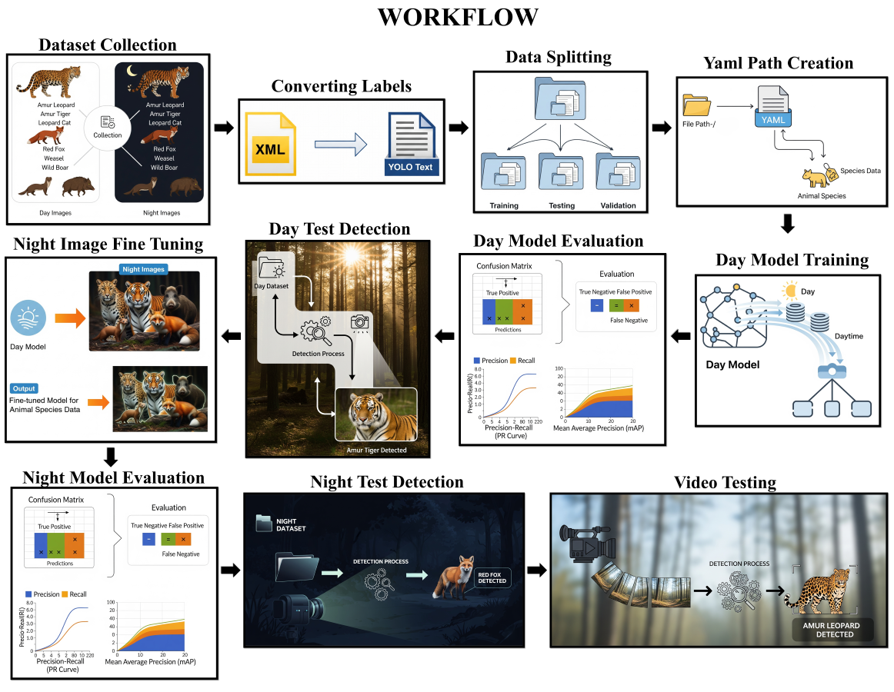

## 📚 Table of Contents

- [📌 Introduction](#introduction)
- [🐾 Wildlife Species Detection using YOLO](#-wildlife-species-detection-using-yolo)
  - [📌 What the Project Does](#-what-the-project-does)
  - [🌟 Why the Project is Useful](#-why-the-project-is-useful)
  - [🚀 How Users Can Get Started with the Project](#-how-users-can-get-started-with-the-project)
    - [📦 Step 1: Preparing the Dataset](#-step-1-preparing-the-dataset)
    - [🔄 Step 2: Converting XML to YOLO Format](#-step-2-converting-xml-to-yolo-format)
    - [🗂 Step 3: Organize Dataset into Training, Validation, and Test Sets](#-step-3-organize-dataset-into-training-validation-and-test-sets)
    - [📝 Step 4: Create YAML Files for YOLO Training](#-step-4-create-yaml-files-for-yolo-training)
    - [🎯 Step 5: Training and Evaluating the YOLO Models](#-step-5-training-and-evaluating-the-yolo-models)
- [📁 Structure of the Project](#structure-of-the-project)
- [👥 Project Authors](#-project-authors)

---

# Introduction
Accurate identification of animal species is a critical component for wildlife monitoring. Camera traps are used a lot for this, especially those equipped with night-vision capabilities. These cameras take pictures even in the dark. However, these night-time images suffer challenges such as poor illumination, motion blur, etc., making manual species identification difficult.

This project aims to develop a machine learning model capable of detecting and classifying six different animal species from night-vision camera trap images and videos. The goal is to build a model that mimics the human ability to recognize animals even under difficult visual conditions.

We will utilize YOLO (You Only Look Once) algorithm, an objection detection model which is known for its real-time processing speed and high accuracy. Specifically we will use both Yolo11 and Yolo12. It is also well suited for complex background, which is also present in wildlife images.

---

# 🐾 Wildlife Species Detection using YOLO

## 📌 What the Project Does

This project focuses on the **automated detection and classification of wildlife species** captured using **night-vision camera traps**, using the **YOLO (You Only Look Once)** object detection algorithm. The system is trained to identify **six animal species** (or more, depending on your selection) in challenging visual environments, particularly during night time when traditional image clarity is compromised.

We have taken AmurLeopard, AmurTiger, LeopardCat, RedFox, Weasel, WildBoar for training and testing.

By training a **custom YOLOv11/YOLOv12 model** on annotated wildlife images, this project enables real-time animal detection with high **precision** and **recall** in both day and night settings.

---

## 🌟 Why the Project is Useful

- 🦊 **Wildlife Monitoring**: Automatically processes thousands of images, reducing the need for manual species identification.
- 🌍 **Conservation Efforts**: Helps in the timely monitoring of endangered or invasive species.
- ⚡ **Speed & Accuracy**: YOLO delivers real-time object detection with high accuracy in complex, cluttered backgrounds.
- 🌙 **Low-Light Adaptation**: Specifically fine-tuned to work with poor illumination and motion blur in night-time images.
- 🎥 **Video Detection**: Helps in detecting the species from video which further can be used for live monitoring.

---

## 🚀 How Users Can Get Started with the Project



## 📦 Step 1: Preparing the Dataset

- 📥 Download the dataset from the following link:👉 https://github.com/myyyyw/NTLNP
- Follow the instructions in the repository link to download the dataset.
- The downloaded file will contain two folders:
  
  ├── 📁 voc_day
  
  └──  📁 voc_night

- Each of these folders should have the following structure:

  ├── 📁 JPEGImages  (Contains image files (.jpg))
  
  └── 📁 Annotations (Contains bounding box annotations in Pascal VOC (.xml) format)

- Now create a new separate folder for this project. Inside it follow the same folder format:

  - 📁 Day
  
     - 📁 JPEGImages
   
     - 📁 Annotations
  
  - 📁 Night
  
     - 📁 JPEGImages
   
     - 📁 Annotations

- 🐾 There are a total of 17 species. You can select any number of species you want from voc_day and voc_night and store JPEGImages and Annotations in Day and Night folders respectively.
- 📌Make sure to correctly store the image and its respective annotation.
-  If you're using your own images, follow the same folder format.

## 🔄 Step 2: Converting XML to YOLO Format

YOLO requires annotations in `.txt` format. A conversion script (`script.py`) is provided in this repository.

Before running the script:
- Open `script.py` and modify the `species` list to include the names of only those species you want to include in your model.

### 🔧 Instructions:

1. Place `script.py` in the same folder where `Annotations/` and `JPEGImages/` are located.
2. Open a terminal in that folder.
3. Run the script using the following command:

```bash
python script.py
```

Do this for both Day and Night. This will generate a new folder called `labels` that contains YOLO-compatible `.txt` annotation files.

## 🗂 Step 3: Organize Dataset into Training, Validation, and Test Sets

Again open the terminal in the same location and open jupyter notebook from the following command:

```
jupyter notebook
```

Create a new ipynb file and paste the code given in `dataset_split.ipynb`. This script automates the process of:
- Splitting your Day and Night datasets into **training**, **validation**, and **test** sets.
- The split ratio is **70%** training, **15%** validation and **15%** test.
- Organizing images and labels into the required YOLO format folder structure.

Make sure that this ipynb file is present in the same location as of the datasets.

### What the script does:

- Takes images and corresponding `.txt` labels from the original `Day` and `Night` folders.
- Creates two new folders:  
  - 📁 dataset_day
  - 📁 dataset_night

Each contains the following subfolders:
- 📁 images
  - 📁 train
  - 📁 val
  - 📁 test
- 📁 labels
  - 📁 train
  - 📁 val
  - 📁 test

## 📝 Step 4: Create YAML Files for YOLO Training

To train a YOLO model using the Ultralytics framework, you need a `.yaml` file that defines:

- The paths to your training and validation datasets
- The list of species (classes) you're training on

YAML files act as **configuration files** that tell YOLO where your data is and what to label.

### 📂 Files Already Provided

Two YAML files are already included in this repository:
- `dataset_day.yaml`
- `dataset_night.yaml`

You can use these as templates and **edit them as needed**. Make sure to store these files in the same location where the dataset folders are located. Dont put them inside the dataset folders.

### 🧠 What to Update

1. **Species List (Class Names):**  
   Update the `names:` section to match the exact species you're training on.  
   Example:
   ```yaml
   names:
     0: AmurLeopard
     1: AmurTiger
     2: LeopardCat
     3: RedFox
     4: Weasel
     5: WildBoar

2. Label Index Must Match Text Files:
   - The index numbers (0, 1, 2...) must match the first number in each line of your .txt label
   files.
   - For example, if a label file starts with 2 0.56 0.33 0.25 0.18, it corresponds to the
   species at index 2 in the YAML file (Leopard in this case).
   - Make sure to check the index number of each species in one of their label files and update it in the yaml file.

## 🎯 Step 5: Training and Evaluating the YOLO Models

To train and evaluate your YOLO models, four Jupyter Notebook files have been provided in this repository:

- `yolo11_day.ipynb`
- `yolo11_night.ipynb`
- `yolo12_day.ipynb`
- `yolo12_night.ipynb`

These notebooks contain the full pipeline for:
- Training on the `Day` dataset
- Fine-tuning on the `Night` dataset
- Evaluating model performance
- Running inference on test images and videos

More instructions are given inside the notebook for model training and evaluation. Make sure to place the notebook files in the same location as of the datasets.

---

# Structure of the Project

Before starting training the model, your project structure should look like below.

📁 Project Root  
├── 📁 Day  
│    ├── 🗂️ Annotations  
│    ├── 🖼️ JPEGImages  
│    ├── 🏷️ labels  
│    └── 📜 script.py  
├── 📁 Night  
│    ├── 🗂️ Annotations  
│    ├── 🖼️ JPEGImages  
│    ├── 🏷️ labels  
│    └── 📜 script.py  
├── 📁 dataset_day  
│    ├── 📁 images  
│    │    ├── 🧪 test  
│    │    ├── 🏋️ train  
│    │    └── ✅ val  
│    ├── 📁 labels  
│    │    ├── 🧪 test  
│    │    ├── 🏋️ train  
│    │    └── ✅ val  
├── 📁 dataset_night  
│    ├── 📁 images  
│    │    ├── 🧪 test  
│    │    ├── 🏋️ train  
│    │    └── ✅ val  
│    ├── 📁 labels  
│    │    ├── 🧪 test  
│    │    ├── 🏋️ train  
│    │    └── ✅ val  
├── 📄 dataset_day.yaml  
├── 📄 dataset_night.yaml  
├── 📓 dataset_split.ipynb  
├── 📓 yolo11_day.ipynb 

├── 📓 yolo11_night.ipynb

├── 📓 yolo12_day.ipynb 

└── 📓 yolo12_night.ipynb  

---

## 👥 Project Authors

This project has been jointly developed by:

- **Harsh Mehta**  
- **Pranav Agwan**  

We both are Master's students in the **Data & Computational Science** program at **University College Dublin**, and we collaborated on this project with the goal of applying advanced machine learning techniques to real-world ecological challenges, specifically in the domain of automated wildlife species detection using night-vision imagery.

- 💡 We welcome constructive feedback and contributions from the community.
- 🛠 To contribute, feel free to fork the repository, create a new feature branch, and submit a Pull Request (PR).
